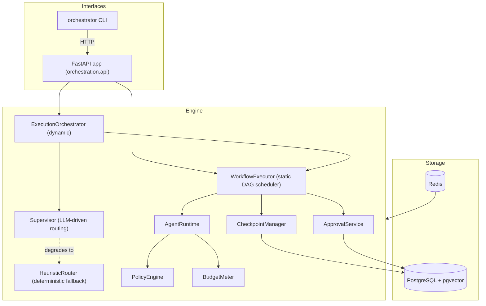

# Phase 2 Architecture Audit

Phase 2.1 of the Phase 2 spec. This document is a factual snapshot of what
exists in this repository today, gathered by reading the actual source
(`grep`/`find`/`pytest --collect-only`, not memory), so that everything that
follows in Phase 2 is scoped against reality rather than assumption. It does
not propose or implement anything.

## 1. Current architecture

Full narrative version: [`architecture.md`](architecture.md). This audit
only restates the parts Phase 2 needs to build against.

## 2. Existing modules (`src/orchestration/`, 87 `.py` files)

| Package | Contents |
|---|---|
| `domain/` | Pydantic v2 models: `agent.py`, `approval.py`, `budget.py`, `checkpoint.py`, `enums.py`, `evaluation.py`, `events.py`, `execution.py`, `model.py`, `retry.py`, `routing.py`, `tool.py`, `workflow.py`, `base.py` |
| `runtime/` | `orchestrator.py` (`ExecutionOrchestrator`, dynamic path), `AgentRuntime` |
| `workflow/` | `WorkflowExecutor` (static DAG scheduler both paths share) |
| `supervisor/` | LLM-driven routing decision logic |
| `routing/` | `HeuristicRouter`, the deterministic fallback |
| `llm/` | `base.py` (protocol), `factory.py`, `mock.py` (`MockProvider`), `providers.py` (`OpenAICompatibleProvider`, `AnthropicProvider`, `GeminiProvider`) |
| `tools/` | `base.py`, `builtin.py`, `registry.py` |
| `policies/` | `PolicyEngine` (deny-by-default tool permissions) |
| `budget/` | `BudgetMeter` |
| `checkpoint/` | `CheckpointManager` |
| `coordination/` | cross-cutting execution coordination (semaphores etc.) |
| `events/` | `bus.py` (`EventBus`, `ExecutionEventRecorder`) |
| `persistence/` | `tables.py` (SQLAlchemy Core tables), `repositories.py` |
| `models/` | (distinct from `domain/` -- ORM/table-adjacent layer) |
| `observability/` | structlog, OpenTelemetry, Prometheus wiring |
| `api/` | FastAPI app (§3) |
| `cli/` | Typer CLI (`client.py`, `main.py`, `benchmark_command.py`) |
| `evaluation/` | benchmark harness (§8) |
| `agents/` | agent definitions/helpers |
| `state/` | **empty** -- no files exist in this directory yet |

`src/orchestration/state/` is a scaffold with no implementation. Any Phase 2
work that assumes a "state" module already exists is wrong; it would be new
code, not an extension.

## 3. Existing APIs (`src/orchestration/api/`)

Factory: `create_app(settings=None, *, llm=None, database=None, redis=None)`
in `app.py`. Supporting files: `state.py` (`AppState`, `build_app_state()`,
`close_app_state()`), `runner.py` (`ExecutionRunner` -- background-task
execution driver within the API process), `errors.py`
(`install_exception_handlers()`), `security.py` (`get_app_state()`,
`require_api_key()`), `schemas.py`.

16 routes across 4 route modules:

| Module | Routes |
|---|---|
| `routes/agents.py` | `POST /agents`, `GET /agents`, `GET /agents/{agent_id}` |
| `routes/workflows.py` | `POST /workflows`, `GET /workflows`, `GET /workflows/{workflow_id}` |
| `routes/executions.py` | `POST /executions`, `GET /executions/{execution_id}`, `POST /executions/{execution_id}/cancel`, `POST /executions/{execution_id}/resume`, `POST /executions/{execution_id}/approve`, `POST /executions/{execution_id}/reject`, `GET /executions/{execution_id}/events`, `GET /executions/{execution_id}/trace` |
| `routes/system.py` | `GET /health`, `GET /metrics` |

**Update, post Phase 2.3**: a live-streaming endpoint now exists --
`GET /executions/{execution_id}/stream` (Server-Sent Events), reading from
the Redis stream `RedisEventSink` already published every event to (this
sink predates Phase 2 and was already wired into `ExecutionRunner`; only the
HTTP-facing route was missing). `GET /executions/{id}/events` is unchanged
and remains the durable, complete history. See
[`interfaces.md`](interfaces.md#live-event-streaming) for the contract.

Auth: `require_api_key()` checks `X-API-Key` against `AppState`'s configured
key set; `ORCH_API_REQUIRE_AUTH` defaults on and is hardcoded `true` in
`docker-compose.yml`.

## 4. Existing database schema

14 tables (`persistence/tables.py`, `ALL_TABLES`): `agents`, `tools`,
`workflows`, `workflow_nodes`, `workflow_edges`, `executions`,
`execution_states`, `checkpoints`, `execution_events`, `agent_invocations`,
`tool_invocations`, `approvals`, `evidence_chunks`, `benchmark_runs`.

`evidence_chunks` is the only pgvector-backed table (embeddings for
retrieval-style tool use). Schema is owned exclusively by Alembic migrations
under `migrations/versions/` -- both the bare-metal and Docker setups run
the same migrations; nothing hand-edits the schema outside that path (see
[`deployment.md`](deployment.md)). Any new table Phase 2 needs (e.g. a
denormalized event-stream cursor table, a workflow-builder draft table) must
go through a new Alembic migration, not a manual `CREATE TABLE`.

## 5. Execution lifecycle

Two execution paths share one scheduler (`WorkflowExecutor`) -- see
[`architecture.md`](architecture.md) and
[`dynamic-orchestration.md`](dynamic-orchestration.md) for the full
explanation of why, and of the round-drain problem this reuse produces.

- **Static**: a hand-authored `Workflow` (nodes/edges known up front) runs
  directly through `WorkflowExecutor`.
- **Dynamic**: `ExecutionOrchestrator` has no workflow at the start; it asks
  `Supervisor.decide()` for one `RoutingDecision` per turn and compiles it
  into new nodes on a graph that starts as a single terminal placeholder and
  grows every turn. Each turn runs a fresh `WorkflowExecutor` over the
  growing graph.

`ExecutionStatus` (6 members, `domain/enums.py`): `PENDING`, `RUNNING`,
`WAITING_FOR_APPROVAL`, `SUCCEEDED`, `FAILED`, `CANCELLED`. There is no
`BUDGET_EXCEEDED` or `TIMED_OUT` execution-level status -- those are
outcomes reached via `FAILED` with a reason recorded elsewhere (checkpoint
reason / event payload), not distinct top-level statuses. Anything Phase 2
UI renders as an execution's overall status must map to these 6 values.

`NodeStatus` (8 members): `PENDING`, `READY`, `RUNNING`, `SUCCEEDED`,
`FAILED`, `SKIPPED`, `CANCELLED`, `WAITING_FOR_APPROVAL`. There is no
distinct `RETRYING` status -- a retried node stays `RUNNING` with an
incrementing `attempts` counter on the node's state rather than transitioning
through a separate visible status. A Phase 2 UI that wants to show "this node
is retrying" must derive it from `attempts > 1` while `status == RUNNING`,
not from a status value that doesn't exist.

## 6. Current event model

*(Note: §14/§16 below described this as a gap; it has since been closed --
see the update in §3 above.)*

`EventType` (`domain/enums.py`), 29 members, grouped:

- Execution: `EXECUTION_STARTED/COMPLETED/FAILED/CANCELLED/RESUMED`
- Node: `NODE_STARTED/COMPLETED/FAILED/SKIPPED`
- Agent: `AGENT_INVOKED/COMPLETED/FAILED`
- Tool: `TOOL_INVOKED/COMPLETED/FAILED/DENIED`
- LLM: `LLM_CALL_STARTED/COMPLETED`
- Routing: `SUPERVISOR_DECIDED`, `ROUTING_DEGRADED`, `REPLANNED`
- Retry: `RETRY_STARTED/EXHAUSTED`
- Checkpoint: `CHECKPOINT_CREATED/RESTORED`
- Approval: `APPROVAL_REQUESTED/GRANTED/REJECTED/EXPIRED`

Events are recorded via `ExecutionEventRecorder.emit(event_type, payload)`
(`events/bus.py`) into the `execution_events` table and forwarded to an
in-process `EventBus`. There is currently no subscriber that turns
`EventBus` activity into an outbound stream (SSE/WebSocket) to an external
client -- the bus today is consumed only within the same process
(observability hooks). This is the concrete extension point for Phase 2's
live-streaming requirement: a new subscriber, not a change to how events are
emitted or stored.

## 7. Current state model

`ExecutionState` (`domain/execution.py`) is the durable heart of a run: node
statuses, agent outputs, budget usage, pending approval id, everything
needed to resume. All domain models are `extra="forbid"` Pydantic v2 with
`StrEnum` fields throughout, which is what makes round-tripping through
PostgreSQL JSONB safe. `CheckpointReason` includes `ROUND_COMPLETED`
(added to support the dynamic path's per-turn checkpointing -- see
`dynamic-orchestration.md`).

## 8. Current provider abstraction

`llm/base.py` defines the provider protocol; `llm/factory.py` builds a
provider from settings; `llm/mock.py`'s `MockProvider` scripts exact replies
(used by every demo and every benchmark scenario, never randomized);
`llm/providers.py` has three real HTTP-backed adapters:
`OpenAICompatibleProvider`, `AnthropicProvider`, `GeminiProvider`, all
subclassing a shared `HttpLLMProvider`. `Settings` (`config.py`) already has
`ollama_enabled: bool = False` and `ollama_base_url` (default
`http://127.0.0.1:11434/v1`) -- since Ollama exposes an
OpenAI-compatible endpoint, `OpenAICompatibleProvider` pointed at
`ollama_base_url` is very likely already sufficient wiring for local-model
support; this needs to be verified by an actual run against a local Ollama
instance before Phase 2 claims it as "already works," but no new provider
class should be needed.

**Update**: Ollama wiring is now verified, not just inferred. No real
Ollama install is available in this environment, so the strongest
available proof was used: a real `httpx` request/response cycle
(`OpenAICompatibleProvider.complete()`, unmodified) against a fake
transport that speaks Ollama's actual documented `/v1/chat/completions`
shape -- URL construction (`http://127.0.0.1:11434/v1/chat/completions`),
no-auth-header behavior, payload serialisation, and response parsing are
all exercised for real; only the transport is swapped
(`tests/unit/test_llm.py::test_ollama_round_trip_against_a_real_openai_compatible_endpoint`).
Confirms the original inference: no new provider code was needed.

No MCP (Model Context Protocol) client or adapter exists anywhere in this
codebase. `tools/registry.py` is a plain in-process registry of
`ToolDefinition`s with handlers; there is no concept of a remote tool server
today. MCP support is genuinely new work, not an extension of an existing
partial implementation.

## 9. Current tool abstraction

`tools/base.py` defines `ToolDefinition`/`ToolResult` shapes; `builtin.py`
ships the built-in tools (web-search-style, shell, etc. -- shell is
deny-by-default per `budget-and-policies.md`); `registry.py` is the
in-process lookup used by `AgentRuntime`. Every tool call passes through
`PolicyEngine` (deny-by-default) before running, and every invocation is
persisted to `tool_invocations`.

## 10. Current observability

structlog (JSON or console format via `ORCH_LOG_FORMAT`), OpenTelemetry
(`ORCH_TRACING_ENABLED` + `ORCH_TRACE_EXPORTER`, no-op when off), Prometheus
metrics exposed at `GET /metrics`. Full detail in
[`observability.md`](observability.md).

## 11. Current benchmark system

`evaluation/` package: `arms.py` (4 arms), `judge.py`, `harness.py`,
`scenarios.py` (54 scenarios), `report.py`. Reports persist to
`benchmark_runs` (table) and `benchmarks/results/*.json`. Full detail and
real committed numbers in [`evaluation-benchmark.md`](evaluation-benchmark.md).
CLI: `orchestrator benchmark ...`.

## 12. Current frontend status

**Update, post frontend-foundation slice**: `frontend/` now exists -- a
Next.js 16 (App Router) + TypeScript + Tailwind v4 app, `create-next-app`
scaffolded, with:

- `src/lib/api.ts` -- a server-only client for the existing REST routes
  (`ORCHESTRATOR_API_KEY` is read only in Server Components/Route Handlers,
  never sent to the browser bundle).
- `/` -- a dashboard listing recent executions (via the new
  `GET /executions`), with agent/workflow counts.
- `/executions/[id]` -- an execution detail page: node table, budget usage,
  and either the recorded event log (terminal executions) or a live view
  (in-flight ones).
- `src/app/api/stream/[id]/route.ts` -- a same-origin SSE proxy: forwards
  `GET /executions/{id}/stream` byte-for-byte, attaching the API key
  server-side, so the browser's own `EventSource` (which cannot set custom
  headers) can consume it directly without ever seeing the key.

Verified against the real running API (real Postgres/Redis, `MockProvider`
routing since no LLM key is configured yet): `next build` type-checks
clean, `npx eslint .` is clean, and a real execution created via `curl`
rendered correctly on both the dashboard and detail page, with the SSE
proxy streaming real, correctly-ordered events end to end.

Also: a scoped security pass over this session's own new frontend surface
(no diff was reviewable against `origin/HEAD` since everything was already
pushed, so this was a manual review, not the `security-review` skill).
Found and fixed one real issue: every `src/lib/api.ts` function and the
SSE proxy route (`api/stream/[id]/route.ts`) interpolated a route param
(`executionId`, `reportId`) directly into a URL template before parsing --
an id containing `?`/`#` could inject extra query parameters or a
fragment into the upstream request. Fixed by wrapping every such id in
`encodeURIComponent()`. Reviewed and found already sound: every new route
sits behind `require_api_key` (checked directly, not assumed); tool
arguments are redacted before `InvocationRecorder.record_tool` persists
them (same `_redact()` used for approval parameters); and the HITL
Server Action's bound `executionId`/`approvalId`/`decision` arguments are
protected by Next.js's own closure encryption, not by anything this app
added. One accepted, pre-existing-pattern gap, not fixed: a tool call's
*result* (as opposed to its arguments) is stored in `tool_invocations`
unredacted -- consistent with how `execution_states.tool_outputs` already
stores results unredacted elsewhere in this system, and not returned by
either route (`GET /tool-invocations` deliberately omits `result`), so it
does not change the API's actual exposure surface.

Also built: execution replay on the detail page (`replay.tsx`) -- a
play/pause/step/scrub control over a terminal execution's already-fetched
event list. Needed no new backend data: node status at any point in the
timeline is reconstructed client-side purely from
`(event.type, event.node_id)`, which every node-lifecycle event already
carries as top-level fields (see `WorkflowExecutor`'s `emit()` calls in
§6). Replaces the previous static "Event log" section for terminal
executions; an in-flight execution still gets the live SSE view.

Also built: an evaluation/ablation dashboard (`/benchmarks`,
`/benchmarks/[id]`), backed by two new routes
(`GET /benchmarks`, `GET /benchmarks/{report_id}`) reading
`BenchmarkRepository` -- whose write side (`save`, called from
`evaluation/report.py::run_benchmark`) was already live, unlike the
invocation tables below; this slice needed no engine wiring, only routes
and UI. The detail page renders the same arm-comparison numbers
`docs/evaluation-benchmark.md` documents, plus a per-category,
per-scenario pass/fail grid across arms. Verified against a real
`orchestrator benchmark --category simple` run: the persisted report
appeared correctly in both routes and both pages.

Also built: a tool/agent invocation inspection panel on the detail page,
backed by two new routes (`GET /executions/{id}/agent-invocations`,
`GET /executions/{id}/tool-invocations`). Building this surfaced a real
pre-existing gap: `agent_invocations`/`tool_invocations` (§4) had a full
domain model, table, and repository, but nothing in the live execution
path actually wrote to them -- `InvocationRepository.record_agent`/
`claim_tool`/`complete_tool` were only ever exercised by
`tests/integration/test_persistence.py` directly. Fixed by wiring real
writes: `WorkflowExecutor`/`ExecutionOrchestrator` gained an
`invocation_recorder` (mirroring the existing `CheckpointWriter` pattern,
same no-op default) called after every agent run, and `AgentRuntime`'s
previously-unused `ToolObserver` hook (widened from `(agent_id, result)` to
`(execution_id, node_id, agent_id, redacted_arguments, result)`) is now
wired to record every tool call. Both flow through a new
`persistence/invocation_recorder.py::InvocationRecorder`, constructed once
per execution in `api/runner.py`. Verified against the real running API: a
live execution's agents were recorded and readable through both the new
routes and the frontend panel. Known limitation, documented rather than
silently handled: a direct `TOOL`-kind workflow node (no agent in the
loop) bypasses `AgentRuntime` entirely and is not yet wired for recording.

Also built: a human-in-the-loop approve/reject UI on the detail page,
backed by a new `GET /executions/{id}/approvals` route (exposing the
previously-unused `ApprovalService.pending_for`) and a Next.js Server
Action (`approval-actions.ts`) that calls the existing `/approve`/`/reject`
routes server-side and revalidates the page. Verified: the route returns
`[]` for an execution with nothing pending (checked against the real
running API), and the full approve/reject HTTP flow is covered by the
existing `TestApprovalFlow` integration tests plus a new one asserting the
listing surfaces the actual `action`/`risk_reason` a reviewer needs to see.

By deliberate choice, the workflow itself (the graph structure -- which
nodes exist, how they depend on each other) is **not** surfaced to the
user; only the step-by-step execution log/timeline is. For the dynamic
path (most executions here), there is no graph to show up front anyway --
the supervisor builds it one decision at a time, at the same pace the log
already narrates (see `dynamic-orchestration.md`). A graph visualization
remains a possible, but explicitly deferred, purely-presentational addition
on data the API already returns.

Not yet built: React Flow workflow graph visualization (deferred, see
above), execution replay scrubbing, tool inspection UI, the
evaluation/ablation dashboard, and the workflow builder -- all still open
per §14.

## 13. Test suite baseline

`pytest --collect-only -q` reports 888 tests collected, across 20
`test_*.py` files under `tests/`. `pytest.ini_options` markers: `unit`,
`integration` (real PostgreSQL + Redis, never mocked), `failure`,
`benchmark`, `slow`. CI (`.github/workflows/ci.yml`) runs 7 jobs: `lint`,
`typecheck`, `security`, `unit`, `integration`, `benchmark-smoke`,
`docker-smoke` -- the last two using real service containers
(`pgvector/pgvector:0.8.6-pg18`, `redis:7.2-alpine`), consistent with this
project's standing rule of never mocking the database or Redis in a test
that claims to verify integration.

## 14. Gaps Phase 2 needs to address

Concretely, mapped to what's above:

- ~~No streaming transport~~ -- closed; see §3.
- ~~No frontend at all~~ -- a foundation now exists; see §12. Still open:
  workflow graph visualization, replay, tool inspection, HITL approval UI,
  evaluation dashboard, workflow builder.
- No MCP client (§8) -- full new adapter, genuinely new surface.
- Ollama: likely already wired at the config/provider level (§8) but
  unverified by an actual run -- verify before building anything new on top.
- No workflow-builder persistence beyond the existing `workflows` /
  `workflow_nodes` / `workflow_edges` tables (§4) -- a builder UI can target
  the existing `POST /workflows` shape; whether that's sufficient for a
  "limited-scope" builder needs to be decided against the existing
  `Workflow`/`WorkflowNode` Pydantic models before designing new endpoints.
- No demo/zero-API-key mode beyond what `MockProvider` already gives the
  benchmark and example scripts -- extending that pattern to a
  browsable/demoable API mode is new wiring, not new provider logic.

## 15. Reusable as-is

`WorkflowExecutor`, `ExecutionOrchestrator`, `Supervisor`/`HeuristicRouter`,
`BudgetMeter`, `PolicyEngine`, `CheckpointManager`, `ApprovalService`, the
full `domain/` model set, all 14 tables and their migrations, the existing
16 API routes, the CLI, the evaluation harness, all three real LLM provider
adapters. None of these need to change shape for Phase 2's web UI to consume
them -- the UI is a new client of existing APIs plus new
read-mostly/streaming additions.

## 16. Needs extension (not replacement)

- ~~`events/bus.py` -- add a subscriber that can push to an SSE/WebSocket
  connection~~ -- done via `api/routes/executions.py`'s new
  `GET /{execution_id}/stream`, which reads the existing `RedisEventSink`
  stream directly rather than adding a new bus subscriber; the emit/record
  path itself was untouched. Existing routes kept their current
  request/response shapes.
- `Settings` (`config.py`) -- likely needs new `ORCH_*` variables for
  frontend-facing concerns (CORS origins, an SSE keep-alive interval), not a
  redesign.

## 17. Should NOT be modified

- The 14-table schema's existing columns/types (additive migrations only).
- `ExecutionStatus` / `NodeStatus` values (§5) -- any UI-side "retrying" or
  "budget exceeded" concept must be derived, not added as new engine states,
  to avoid breaking every piece of code (persistence, benchmark judge,
  checkpoint logic) that pattern-matches on these enums today.
- `WorkflowExecutor`'s and `ExecutionOrchestrator`'s core scheduling logic --
  see `dynamic-orchestration.md` for how carefully the round-drain fix was
  scoped to avoid touching the static path's semantics; the same discipline
  applies to any Phase 2 change here.
- The existing 16 API routes' request/response schemas.
- `MockProvider`'s determinism guarantee (exact scripted replies, zero
  randomness) -- this is what makes the 888 tests and 54 benchmark scenarios
  reproducible; any zero-API-key demo mode must not compromise it.

## 18. Architectural risks

- **Streaming vs. single-process execution ownership.** `ExecutionRunner`
  already documents (in `deployment.md`) that execution ownership is
  single-process; an SSE/WebSocket layer must be designed against that same
  constraint (a client connects to the process actually running the
  execution) rather than assuming a multi-process fanout that doesn't exist
  yet.
- **Event volume.** 29 event types, `NODE`/`TOOL`/`LLM_CALL` events fire
  per-node and per-call -- a naive "stream every event" implementation on a
  wide parallel execution could produce a lot of traffic; needs backpressure
  or batching consideration, not assumed to be fine by default.
- **MCP as an unbounded trust boundary.** A remote MCP tool server is a new
  kind of external dependency this codebase has never had (today's tools are
  all in-process). It should go through `PolicyEngine` exactly like a
  built-in tool, deny-by-default, not bypass policy because it "came from
  MCP."

## 19. Backward-compatibility risks

- The CLI (`orchestrator ...`) and the three example scripts under
  `examples/` call the existing 16 routes directly; none of Phase 2's new
  endpoints should require changing those existing calls.
- `benchmarks/results/*.json` and the `benchmark_runs` table already have
  external consumers (`docs/evaluation-benchmark.md` cites a specific
  committed report by id) -- any new benchmark/report field must be
  additive.
- CI's `docker-smoke` job builds and runs the compose stack as-is; any new
  service Phase 2 adds to `docker-compose.yml` needs the same health-check
  discipline the existing 4 services have, or that job will start failing.

## See also

- [`architecture.md`](architecture.md), [`dynamic-orchestration.md`](dynamic-orchestration.md),
  [`interfaces.md`](interfaces.md), [`deployment.md`](deployment.md),
  [`evaluation-benchmark.md`](evaluation-benchmark.md), [`observability.md`](observability.md),
  [`budget-and-policies.md`](budget-and-policies.md) -- existing docs this
  audit deliberately does not duplicate.
