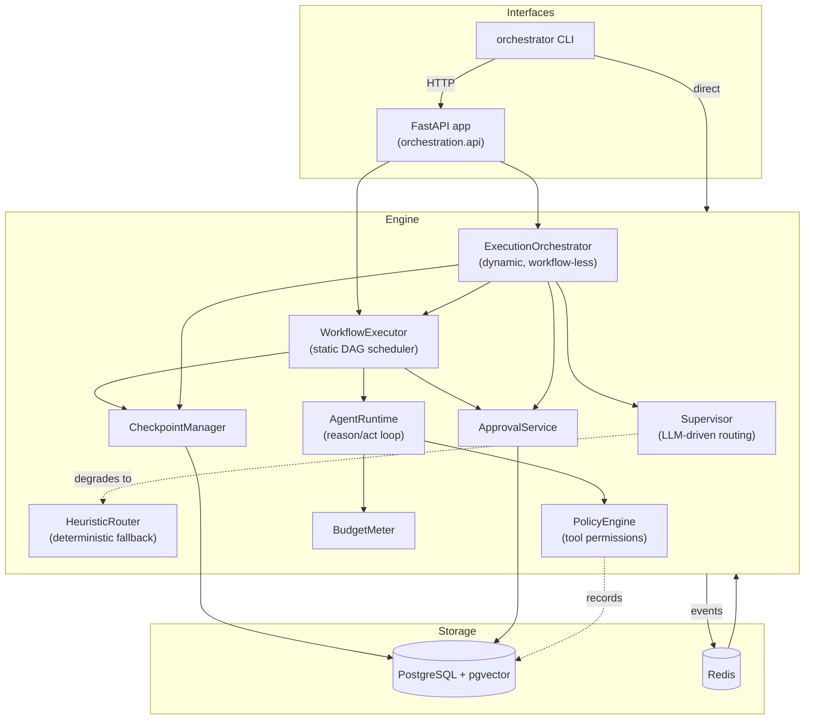

# Architecture

## Component overview

## The two execution paths, one scheduler

A **static** execution runs a hand-authored `Workflow` (nodes and edges known
up front) directly through `WorkflowExecutor`. A **dynamic** execution has no
workflow at all to start: `ExecutionOrchestrator` asks the `Supervisor` for
one decision at a time and compiles each into new nodes on a graph that
starts as a single terminal placeholder and grows every turn.

The two paths share almost everything on purpose: the same `WorkflowExecutor`
runs both (the orchestrator builds a fresh one over the growing graph each
turn), so retries, parallel dispatch, budget checks, and node-level approval
gating are one implementation, not two. See
[`dynamic-orchestration.md`](dynamic-orchestration.md) for the one structural
problem this reuse produced, and how it's solved.

## Layers, from a request to a database write

1. **Interface** -- the FastAPI app or the CLI accepts a task and creates an
   `ExecutionState` + (for a dynamic run) a seed `Workflow`.
2. **Routing** -- `Supervisor.decide()` asks the LLM for a `RoutingDecision`,
   validated through three layers (schema, semantic, heuristic fallback --
   see [`supervisor-and-routing.md`](supervisor-and-routing.md)).
3. **Scheduling** -- the executor computes the ready set (nodes whose
   dependencies are satisfied), runs them concurrently, and applies each
   node's retry policy on failure.
4. **Enforcement** -- every node checks the shared `BudgetMeter` before and
   after it runs, and every tool call passes through the `PolicyEngine`
   (deny-by-default) before it executes.
5. **Durability** -- state is checkpointed to PostgreSQL at every meaningful
   transition (node start/finish, approval pause, replan, finalization),
   deduplicated by content hash.
6. **Observability** -- every layer emits structured log lines (secrets
   redacted), an OpenTelemetry span, and Prometheus metrics.

## Domain model

Everything the engine reasons about is a Pydantic v2 model in
`orchestration.domain`: `ExecutionState` (the durable heart of a run --
holds node statuses, agent outputs, budget usage, everything needed to
resume), `Workflow`/`WorkflowNode`/`WorkflowEdge`, `RoutingDecision`,
`Budget`/`BudgetUsage`, `Checkpoint`, `ApprovalRequest`. All of it is
`extra="forbid"` and uses `StrEnum` throughout, which is what makes it safe
to round-trip through PostgreSQL JSONB without silent drift.

## Where to go next

- [`supervisor-and-routing.md`](supervisor-and-routing.md) -- how a decision
  gets validated before it can affect anything.
- [`workflow-engine.md`](workflow-engine.md) -- the scheduler both paths share.
- [`checkpointing-and-resume.md`](checkpointing-and-resume.md) -- what
  durability actually means here.
