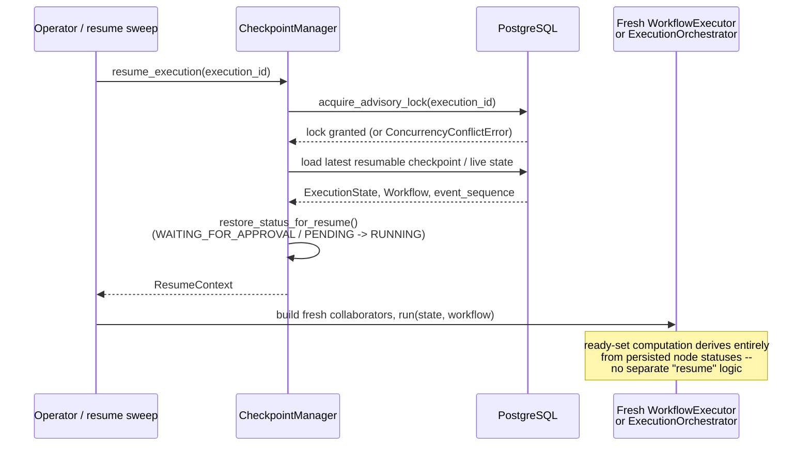

# Checkpointing and resume

`ExecutionState` holds everything a run needs to continue: node statuses and
attempt counts, agent outputs, budget usage, retry counts, the pending
approval id, the final answer once there is one. Nothing about resuming an
execution is a separate code path from running one normally -- `resume` is a
load, plus re-entry into the same executor loop.

## What gets written, and when

A `Checkpoint` bundles the current `ExecutionState`, the `Workflow` as it
stood at that moment, a `CheckpointReason` (`EXECUTION_STARTED`,
`BEFORE_NODE`, `BEFORE_APPROVAL`, `EXECUTION_FINALIZED`, `ON_CANCELLATION`,
`ON_BUDGET_EXCEEDED`, `ROUND_COMPLETED`, ...), and a content hash. Writing a
checkpoint and updating the live `ExecutionStateRow` happen in the same
transaction -- a checkpoint that disagreed with the live state would be worse
than no checkpoint at all, because resume would trust it.

Deduplication is by content hash, computed with `version`/`updated_at`
excluded (bookkeeping fields, not the logical snapshot) -- the common case of
"nothing changed since the last checkpoint" doesn't accumulate identical
rows, and a retried write after a lost acknowledgement collapses to one.

## Resuming

`claim_for_resume` takes a PostgreSQL advisory lock scoped to the
transaction, not the whole resume -- holding it for a multi-minute execution
would block recovery until the connection timed out. It answers one question
("did I win the race to resume this"), and the caller re-verifies state under
optimistic concurrency for the actual work afterward.

`resume` prefers the live `ExecutionStateRow` over the latest checkpoint when
both exist and the state row is at least as advanced -- the state row is
written in the same transaction as the checkpoint, so it's never behind, but
it can be *ahead* if a process died after a state write and before the next
checkpoint.

## Optimistic concurrency

`ExecutionState.version` increments on every persisted mutation.
`ExecutionStateRepository.save()` can be called with `expected_version`
(the version the caller read); a mismatch raises `ConcurrencyConflictError`
rather than silently clobbering a write from a worker that got there first.

## Idempotent side effects

A tool invocation's idempotency key is written *before* the tool runs; if a
resumed attempt finds it already completed, the call is not repeated. This
is what makes a checkpoint-then-crash between "tool ran" and "result
recorded" safe to resume, for tools where repeating the side effect would
matter (an email, a write).

## See also

- [`human-in-the-loop.md`](human-in-the-loop.md) -- the other half of
  durability: a paused approval surviving the same kind of restart.
- [`dynamic-orchestration.md`](dynamic-orchestration.md) -- the one place
  this project found a checkpoint written a half-turn too early, and the fix.
