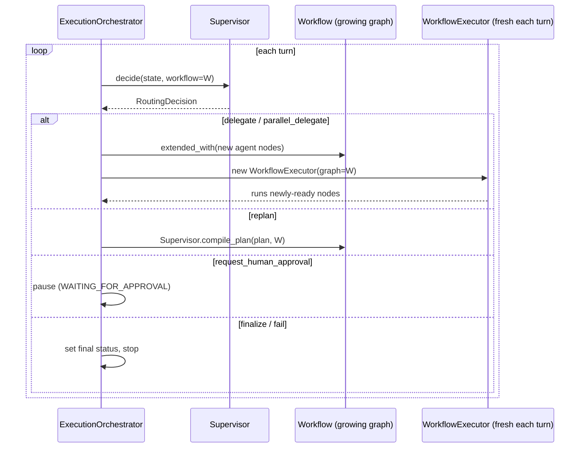

# Dynamic orchestration

`ExecutionOrchestrator` runs a task with no workflow declared up front. It
loops: ask the supervisor for a decision, compile that decision into the
graph, run whatever is now ready, repeat -- until the supervisor finalizes,
fails, or a turn limit is hit.

## Reusing the static executor, not reimplementing it

Each turn's delegation compiles to ordinary `WorkflowNode`s wired from the
graph's current frontier via `Workflow.extended_with()` (which returns a
*new* `Workflow` -- the pre-turn graph stays intact for the checkpoint
history). A brand new `WorkflowExecutor` runs over that graph every turn,
reusing the same `BudgetMeter`, event recorder, checkpoint writer, and cancel
token across turns. This is deliberate: `WorkflowExecutor.run()` is already
resume-safe (its ready-set computation derives entirely from persisted node
statuses), so calling it again each turn to execute only the newly-added
nodes needs no special case -- it's the same property that makes resuming a
crashed process work at all.

## The problem this reuse produced, and the fix

`WorkflowExecutor.run()` finishes -- and marks the whole `ExecutionState`
`SUCCEEDED`/`FAILED` -- the moment its ready-set drains. For a static,
fully-declared graph that's correct: nothing left ready *is* completion. For
a graph still being grown one decision at a time, "nothing left ready this
round" means only "wait for the supervisor's next turn," not "the execution
is over." Wiring every round straight to a terminal node doesn't avoid this:
whichever round happens to drain first ends the whole run early, as soon as
the executor is reused unmodified.

The fix, `ExecutionOrchestrator._recover_from_round_drain()`: after each
non-paused turn, a `SUCCEEDED`/`FAILED` verdict the executor just produced is
reverted back to `RUNNING` (bypassing `transition_to()`'s guard deliberately
-- this is the one case that guard cannot know about) *unless* the verdict
was `CANCELLED`/`BUDGET_EXCEEDED`/`TIMED_OUT`, which are genuine engine-level
stops and must end the run for real. Because the executor had already
durably checkpointed its premature verdict, the revert writes a corrective
checkpoint (`CheckpointReason.ROUND_COMPLETED`) so a crash in the narrow
window between the two would never leave an execution looking permanently
finished when it wasn't.

## Cooperative cancellation

The same `CancelToken` is threaded into every turn's `WorkflowExecutor`, and
checked once more at the top of the loop -- so a cancellation with no node
currently in flight (the supervisor is mid-decision, or the graph is being
compiled) is still honoured rather than only being caught inside a running
node.

## Retry and parallelism as configuration, not code paths

`node_retry_policy` (an optional override applied when compiling
`delegate`/`parallel_delegate` nodes) and `max_concurrent_nodes` (passed
straight through to each turn's `WorkflowExecutor`) are the two knobs the
evaluation benchmark's four arms differ on -- see
[`evaluation-benchmark.md`](evaluation-benchmark.md). Production code leaves
both at their defaults.

## See also

- [`workflow-engine.md`](workflow-engine.md) -- the scheduler itself.
- [`human-in-the-loop.md`](human-in-the-loop.md) -- what happens on
  `request_human_approval`.
