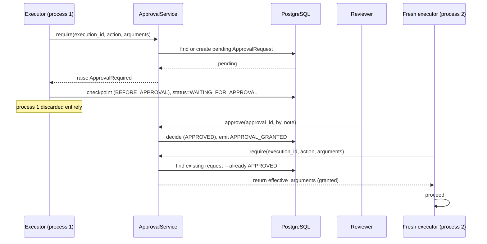

# Human-in-the-loop

Pausing for a human decision is easy; the hard part is what happens on the
way back. A resumed execution re-runs whatever gate paused it -- if that gate
simply raised "approval needed" again, the run would pause forever.

## Approval identity

Every approval is keyed by a hash of exactly what is being approved:

```
key = sha256(execution_id, node_id, action, redacted arguments)[:40]
```

The same gate, reached twice, produces the same key -- so a resumed node
finds its prior decision (`ApprovalRepository.get(request_id)`) instead of
creating a new pending request. This is also what makes `POST /approve`
idempotent: a double-clicked button decides the same record twice, safely.

Arguments are part of the key. Approving a `send_email` call to
`a@b.test` does **not** authorise a subsequent call to `c@d.test` -- different
arguments hash to a different request, so the second call finds nothing
decided and pauses again. Verified directly: `tests/integration/test_approval.py::TestToolLevelApproval::test_an_approval_does_not_transfer_to_different_arguments`.

## The pause and resume sequence



Verified across a genuinely discarded and rebuilt engine, not just a
re-entrant function call, in
`tests/integration/test_approval.py::TestPauseAndResume::test_a_fresh_engine_resumes_and_finishes_after_approval`
and its dynamic-orchestration counterpart in
`tests/integration/test_orchestrator.py`.

## Two entry points, one service

A static workflow's `NodeKind.APPROVAL` node and a dynamic run's
`request_human_approval` supervisor decision both go through the same
`ApprovalService`. A reviewer may also *edit* the arguments on approval
(`modified_arguments`) rather than being forced to reject outright --
narrowing a request ("approve, but only to this one recipient") instead of
starting over.

## Tool-level approval

A HIGH-risk tool call gated by policy (not by the supervisor asking nicely)
goes through `ApprovalService.tool_authoriser()`, which wraps the ordinary
policy-authoriser: the policy still decides *whether* approval is needed,
the wrapper decides whether one has already been granted. Without this
wrapper, a granted tool approval would be re-requested on every subsequent
call with the same arguments, pausing in a loop.

## Expiry

A pending approval left undecided past `default_ttl_seconds` (default one
hour) is treated as a refusal the next time it's read -- evaluated lazily, on
read, rather than by a background sweeper: the only moment expiry actually
matters is when a gate is deciding what to do next.

## See also

- [`checkpointing-and-resume.md`](checkpointing-and-resume.md) -- the
  general durability mechanism an approval pause relies on.
- [`../examples/human_approval/run.py`](../examples/human_approval/run.py) --
  a full runnable demo of this sequence, both approved and rejected.
