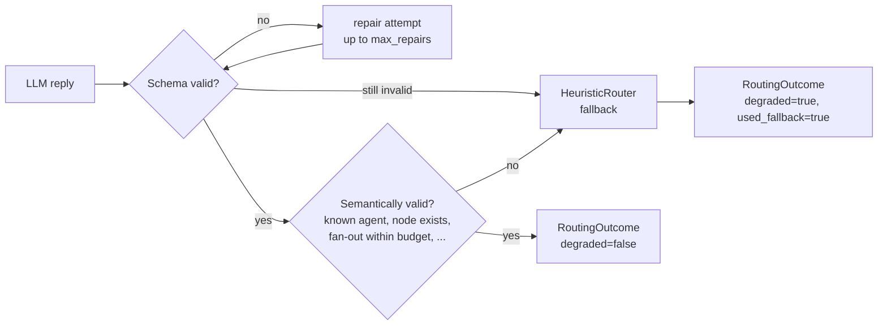

# Supervisor and routing

The supervisor never receives free-text and never has its output
regex-parsed. Every call to `Supervisor.decide()` asks the model for a
`RoutingDecision` against a JSON Schema derived directly from that Pydantic
model, and the reply is validated through three independent layers before it
is trusted with anything.

## The three layers

1. **Schema validation.** `extract_json_object` + Pydantic validation against
   `RoutingDecision.json_schema_for_llm()`. A malformed reply gets one repair
   attempt (re-asking with the validation error included) before falling
   through.
2. **Semantic validation.** A schema-valid decision can still be nonsense: it
   can name an agent that doesn't exist or is disabled, retry a node that
   never ran or already terminally failed, request a plan that would create a
   cycle, or fan out to enough agents to exhaust the budget in one step.
   `Supervisor.validate_decision()` catches all of this -- structurally
   impossible for a JSON Schema alone to express.
3. **Deterministic fallback.** When neither layer produces a usable decision,
   `HeuristicRouter` decides instead, using the same keyword/capability
   matching against each `AgentDefinition`'s declared capabilities -- no LLM
   call, fully deterministic, and exactly the router `orchestrator run`'s
   `baseline` benchmark arm uses on its own (see
   [`evaluation-benchmark.md`](evaluation-benchmark.md)).

Every `RoutingOutcome` reports whether a repair happened (`degraded`) and
whether the fallback was used (`used_fallback`) -- both durable execution
metadata and benchmark signal, never smoothed over.

## What a decision can say

`SupervisorAction` is closed: `delegate`, `parallel_delegate`, `retry`,
`replan`, `request_human_approval`, `respond_directly`, `finalize`, `fail`.
Each carries only the payload that action needs (`DelegationTarget`s for
delegation, a `retry_node_id` for retry, a `DynamicPlan` for replan, an
`approval_action`/`approval_risk_reason` pair for an approval request) --
`RoutingDecision`'s own validators enforce that the right fields are present
for the chosen action before semantic validation ever runs.

## Shortlisting

For a large agent registry, `shortlist_size` narrows the prompt to the
best-scoring candidates by the same keyword/capability match the heuristic
router uses, before the LLM ever sees the task -- smaller prompt, same
routing quality, since the shortlist is deterministic and reproducible.

## See also

- [`dynamic-orchestration.md`](dynamic-orchestration.md) -- what happens to
  a decision once it's validated.
- [`evaluation-benchmark.md`](evaluation-benchmark.md) -- `routing accuracy`
  in the results table is exactly "did `first_action` match the scenario's
  expectation", scored against every arm including the heuristic-only one.
