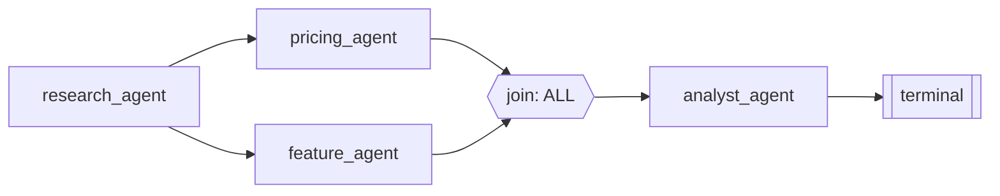

# Workflow engine

`WorkflowExecutor` schedules a `Workflow` -- a DAG of `WorkflowNode`s
connected by `WorkflowEdge`s, each optionally conditional. It is the one
scheduler both a hand-authored workflow and a supervisor-grown one run
through (see [`dynamic-orchestration.md`](dynamic-orchestration.md)).

## Implicit parallelism

There is no explicit fan-out declaration. Each step, the executor computes
the *ready set* -- every node whose inbound edges are either absent, already
satisfied, or resolved-inactive by a condition -- and runs all of them
concurrently via `asyncio.gather`. If the ready set contains three
independent nodes, three run at once; if it contains one, one runs. The
canonical shape:

`a` fans out to `b` and `c`, which run concurrently once `a` completes; `join`
waits per its `JoinPolicy` (`ALL`, `ANY`, `QUORUM`, or `ALL_SETTLED` --
tolerant of partial failure, which is exactly what lets a downstream node
still run when an optional upstream branch failed).

## Conditions, without `eval`

Edge and node conditions are evaluated against a closed operator set (`eq`,
`ne`, `lt`, `lte`, `gt`, `gte`, `in`, `not_in`, `contains`, `exists`,
`not_exists`, `truthy`, `falsy`) over dotted paths into execution state
(`outputs.research.confidence`). Template rendering
(`input_template`/instruction text) is a hand-rolled placeholder substitution,
never `str.format` -- a format-string exposes attribute access that could
otherwise be used to reach outside the intended data.

## Retries

Each node carries its own `RetryPolicy` (max attempts, exponential backoff
with jitter, optional `retry_on`/`never_retry_on` error-code allow/deny
lists). A retryable failure re-runs the *node* from its start with the
computed backoff; the retry loop is scoped inside `_run_node`, so it never
needs the outer scheduling loop to know a retry happened -- `BudgetMeter`
and the event log record it regardless.

Two things do *not* get retried by this loop, because they aren't node
failures: `BudgetExceededError` and `ExecutionCancelledError` are re-raised
past it to the main loop, which is what makes budget exhaustion and
cancellation genuine, immediate stops rather than something a generous retry
policy could paper over.

## Failure semantics

A failed node only ends the run if `_is_blocking_failure()` says so: an
`optional` node's failure never blocks, and neither does a failure whose only
downstream path is a tolerant join (`ALL_SETTLED`/`ANY`/`QUORUM`). This one
function is consulted both mid-run (`_should_stop`, deciding whether to keep
scheduling) and at completion (`_finish`, deciding the final verdict) --
having two separate notions of "does this failure matter" was a real bug
this project hit and fixed early on.

## Approval nodes

A `NodeKind.APPROVAL` node consults the same `ApprovalService` the dynamic
path's `request_human_approval` action uses (see
[`human-in-the-loop.md`](human-in-the-loop.md)): on first encounter it
creates a pending request and the executor pauses
(`NodeStatus.WAITING_FOR_APPROVAL`, `ExecutionStatus.WAITING_FOR_APPROVAL`);
on a resumed encounter it reads the same request's now-decided status.

## Checkpointing

Every meaningful transition -- before/after a node, before finalization,
before/after an approval pause, on cancellation, on budget exhaustion --
writes a checkpoint. See [`checkpointing-and-resume.md`](checkpointing-and-resume.md)
for what that actually persists and how resume reconstructs a run from it.
